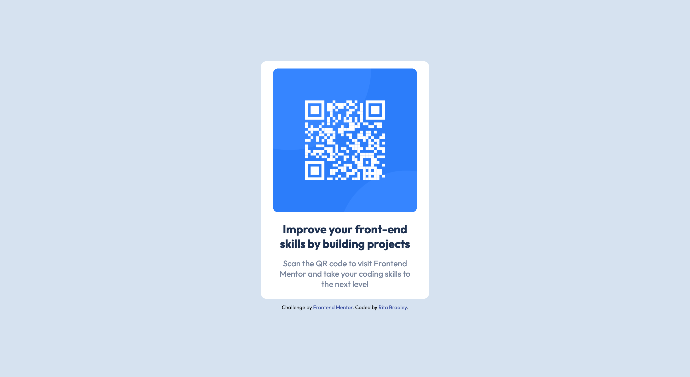

# Frontend Mentor - QR code component solution

This is a solution to the [QR code component challenge on Frontend Mentor](https://www.frontendmentor.io/challenges/qr-code-component-iux_sIO_H). Frontend Mentor challenges help you improve your coding skills by building realistic projects. 

## Table of contents

- [Overview](#overview)
  - [Screenshot](#screenshot)
  - [Links](#links)
- [My process](#my-process)
  - [Built with](#built-with)
  - [What I learned](#what-i-learned)
  - [Continued development](#continued-development)
  - [Useful resources](#useful-resources)
- [Author](#author)
- [Acknowledgments](#acknowledgments)

**Note: Delete this note and update the table of contents based on what sections you keep.**

## Overview

### Screenshot




### Links

- Solution URL: [Source Code](https://github.com/ritabradley/qr-code-component)
- Live Site URL: [Codepen](https://codepen.io/ritabradley_dev/full/LYmvZRp)

## My process

### Built with

- CSS custom properties
- Flexbox
- Mobile-first workflow

### What I learned

I learned when it's more efficient to use `px` instead of `rem`. i hace some trouble withthe desktop sizing because I had the width set in `rem`s.

I set the card width to `350px` because it kept almost the same display as close to the mobile view as possible. I had to adjust the padding and text sizing a little to get it to look right, but other than that, it was fun to work on.


```css
@media (min-width: 768px) {
    .card {
        width: 350px;
        padding: 0 1.2rem;
    }

    .card__details {
        padding: 2rem 1.5rem;
    }

    .card__description {
        font-size: 1.7rem;
    }
}
```

### Continued development

I might tweak the card a little more to make use it's pixel perfect. I'm sure there are more ways in which I can improve this project.

### Useful resources

- [Bunny Fonts](https://fonts.bunny.net) - This is my go to source for fonts. They have the same fonts as Google Fonts but they are GDPR compliant.

## Author

- Frontend Mentor - [@ritabradley](https://www.frontendmentor.io/profile/ritabradley)
- Twitter - [@ritabradley_dev](https://www.twitter.com/ritabradley_dev)
